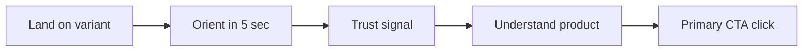

# Gutsphere Landing Page — UI/UX Review

**Last updated:** 2026-07-03  
**Reviewer lens:** Product UI/UX (mobile-first, health-grade, cognitive load, conversion path)  
**Variants:** Record (`/`), You (`/navigators`), Clarity (`/clarity`) — plus **v2** at `/record-v2`, `/navigators-v2`, `/clarity-v2`  
**Design system:** `gutsphere-design` (`--gs-*`, Inter + DM Sans)

**How to use this file:** Pair with [`review.md`](review.md). Update after visual QA, user tests, or v2 iterations. Log changes in Changelog.

---

## Executive summary

| Variant | UX strength | UX risk | Mobile fold grade | Recommended v2 focus |
|---------|-------------|---------|-------------------|----------------------|
| **Record** | Rich proof, strong visual contrast sections | Page fatigue, inconsistent founder bridges, 14 sections | C+ (CTA visible, heavy copy) | Reduce sections 40%; standardize card patterns |
| **You** | Best narrative flow; direct copy; balanced length | Testimonial + mockup stack crowded on tablet; small body text vs Clarity | B | Larger type option; hero layout simplify |
| **Clarity** | Best readability; clearest IA; condition hub | Placeholder phones break trust; 6-tile hub exceeds “3 max” rule | B+ | Real assets; hub hierarchy; sticky CTA |
| **Record_v2** | Pattern-led hero; trimmed IA | Placeholder screenshots | B+ | Real hero screenshot when available |
| **You_v2** | Visit mockup above fold; validation first | 3-col peer grid tight on small phones | A- | Optional mid CTA after validation |
| **Clarity_v2** | Hub + expandable conditions; visit-first showcase | App preview placeholders | A | Ship real screenshots before paid traffic |

**Global blockers before production A/B**
1. ~~Preview switcher bar visible to all visitors~~ — **Fixed:** dev-only (`import.meta.env.DEV` or `VITE_SHOW_VARIANT_SWITCHER`).
2. Clarity screenshot placeholders read as unfinished product — v2 uses `[App preview]` label; real assets still needed.
3. Header nav links differ per variant but hash targets break on `/conditions/*` pages (partially fixed with `/clarity-v2#` prefix).
4. Record v1 uses `FounderBridge` italic quotes — **v2 removed** on Record_v2.

---

## V2 variant audits

### Record_v2 (`/record-v2`) — reviewed 2026-07-03

**Information architecture**
```
Hero (pattern + mockup) → Social proof (1 quote) → Problem (3 cards) → Mid CTA →
Product proof → Daily value → How it works → High severity → FAQ → Founder capsule → Final CTA
```

| UX principle | Before review | After gutsphere-design pass |
|--------------|---------------|-----------------------------|
| One primary CTA per section | **Fail** — SymptomEntryFork had competing coral CTA | **Fixed** — fork links only; one primary in hero |
| Mobile-first hero | **Weak** — fork pushed mockup below fold | **Fixed** — visual column `order-1` on mobile; fork full-width below grid |
| Sentence case | **Fail** — uppercase eyebrows, daily value chips | **Fixed** — sentence case labels throughout |
| Long-form alignment | **Weak** — centered problem intro | **Fixed** — left-aligned section copy |
| Card consistency | Mixed `rounded-2xl` / ad hoc | **Fixed** — `card-surface` on problem + fork cards |
| Touch targets | Fork chips `min-h-11` | **Fixed** — `min-h-12` on fork chips |
| Sticky CTA clearance | Content hidden behind bar | **Fixed** — `pb-20` on mobile wrapper |

| Dimension | Grade | Notes |
|-----------|-------|-------|
| Mobile fold | B+ | H1 + primary CTA visible; mockup immediately below on mobile |
| Cognitive load | 2/5 | Down from Record v1; fork deferred below hero visual |
| Design system | B+ | Tokens only; Inter headings; one primary per section |
| Conversion path | A- | Pattern proof adjacent to claim; mid + sticky CTAs |

**Remaining (P1)**
- [ ] Real app screenshot for hero LCP when assets land in `public/screenshots/`
- [ ] Consider `SectionShell` for rhythm parity with Clarity v2

**V2 checklist (Record)**
- [x] Cap at ~9 sections; merged problem grid
- [x] No `FounderBridge`; founder capsule demoted
- [x] Single social proof band
- [x] Pattern insight in hero
- [x] gutsphere-design pass (sentence case, card-surface, mobile order, CTA hierarchy)

---

### You_v2 persona + content pass — 2026-07-03

**Persona review:** [`you-v2-persona-review.md`](you-v2-persona-review.md)

**Section order (updated)**
```
Hero → Validation → Peer stories → Guides & videos → Your record →
How it works → Privacy → FAQ → Founder → Final CTA
```

| Persona | Key fix |
|---------|---------|
| Explorer | Content library after peers; hero link to `#content`; diagnose FAQ |
| Pattern Seeker | Stool/inflammation guides + video tile; peer story labels |
| Control Reclaimer | Prepare visit featured card; content before product pillars |

| gutsphere-design | Applied |
|------------------|---------|
| One primary CTA per section | Hero: removed secondary button stack |
| Sentence case | Founder capsule eyebrow |
| `min-h-12` touch targets | Content links, FAQ, hero paths |
| `card-surface` rhythm | Peer stories use `section-pad` not custom py |

---

### You_v2 (`/navigators-v2`) — reviewed 2026-07-03

**Information architecture**
```
Hero (visit brief mockup) → Validation → Peer stories (3) → Your record →
How it works → Content teaser → FAQ → Founder capsule → Final CTA
```

| UX principle | Before review | After gutsphere-design pass |
|--------------|---------------|-----------------------------|
| Hero layout | **Weak** — centered long copy; mockup below fork on mobile | **Fixed** — left-aligned; mockup `order-1` on mobile; fork below grid |
| CTA hierarchy | **Fail** — 3 elements with `data-cta="primary"` in hero | **Fixed** — one primary button; micro-step is text link |
| Peer stories depth | 4 cards — scroll fatigue | **Fixed** — 3 featured cards (pattern + visit + simplicity) |
| Pillar cards | All `gs-insight-section` — same weight | **Fixed** — insight highlight on pattern pillar only |
| Sentence case | Uppercase section eyebrows | **Fixed** — validation, peers, record, content |
| External links | No screen-reader hint | **Fixed** — `aria-label` on content cards |

| Dimension | Grade | Notes |
|-----------|-------|-------|
| Mobile fold | A- | Visit brief visible without long scroll |
| Cognitive load | 2/5 | Strong validation early; 3 peer cards not 4 |
| Design system | A- | 17–18px body via `you-v2-landing`; card-surface rhythm |
| Conversion path | A | Visit mockup + validation → product pillars → CTA |

**Remaining (P1)**
- [ ] Mid-page CTA band after validation (optional — sticky bar covers mobile)

**V2 checklist (You)**
- [x] Simplified hero: copy + single visual column
- [x] 17–18px body on You_v2
- [x] Visit mockup above fold on mobile
- [x] FAQ before founder
- [x] gutsphere-design pass

---

### Clarity_v2 mobile pass — 2026-07-03

**Standards applied (from Record_v2 / You_v2 / gutsphere-design)**

| Standard | Clarity v2 fix |
|----------|----------------|
| Visual `order-1` on mobile | Hero phone mockup above copy |
| Left-aligned hero copy | Replaced centered text-only hero |
| One primary CTA + text secondary | Secondary → `#conditions` text link |
| `min-h-12` touch targets | Hub, FAQ, content links, details summary |
| `w-full sm:w-auto` buttons | Calm band, credibility, final CTA, privacy |
| `pb-20 md:pb-0` sticky clearance | Page wrapper unchanged |
| Tighter mobile section rhythm | `clarity-v2-landing` py-12 on mobile |
| Progressive body scale | `clarity-body` 16px mobile → 18px sm+ |
| No duplicate pattern card | Removed from app showcase (dedicated band) |
| v2-specific How it works | `ClarityV2HowItWorks` with smaller phone frames |

**Mobile fold (360×640 target)**

1. Header + phone mockup (visual proof)
2. H1 + primary CTA visible with one scroll nudge
3. Condition hub within ~1.5 viewports

**Remaining**

- [ ] Replace `[App preview]` placeholders
- [ ] Test on real device for sticky CTA + header CTA overlap anxiety

---

### Clarity_v2 (`/clarity-v2`) — reviewed 2026-07-03

**Information architecture**
```
Hero → Condition hub (3 + expandable) → Credibility → Stakes → App showcase (visit first) →
How it works → Calm band → Content (prepare featured) → Proof → FAQ → Final CTA
```

| UX principle | Before review | After gutsphere-design pass |
|--------------|---------------|-----------------------------|
| Duplicate entry | **Fail** — SymptomEntryFork in hero + full hub | **Fixed** — hub only at #2 |
| Progressive disclosure | **Weak** — all 6 conditions always visible | **Fixed** — `<details>` for secondary conditions |
| Icon treatment | Coral fill on hover — decorative overload | **Fixed** — neutral `bg-gs-sand-light` wells |
| Prepare card | Gradient background — off-brand | **Fixed** — `gs-insight-bg` token only |
| App showcase order | Visit brief last | **Fixed** — visit brief first with `fetchPriority="high"` |
| CTA density | Multiple `data-cta` in content section | **Fixed** — one primary at section end |
| Credibility | v1 uppercase labels | **Fixed** — `ClarityV2CredibilitySection` sentence case |
| External links | Missing new-tab labels | **Fixed** — `aria-label` on archive + guide cards |

| Dimension | Grade | Notes |
|-----------|-------|-------|
| Mobile fold | A | Short hero; hub immediately below |
| Cognitive load | 1/5 | Best of three v2s for stressed users |
| Design system | A | Large type preserved; tokens only; no gradients |
| Conversion path | A- | Hub → stakes → visit showcase → calm band |

**Remaining (P0/P1)**
- [ ] Replace `[App preview]` placeholders with real screenshots in `public/screenshots/`
- [ ] Condition stub pages: return link to `/clarity-v2#conditions`

**V2 checklist (Clarity)**
- [x] Hub at #2 with 3 tiles + see all
- [x] Soften hero; tagline as subline
- [x] 6-item FAQ + JSON-LD
- [x] Prepare content card
- [x] gutsphere-design pass

---

## Design system adherence

### What’s consistent (all variants)

- Coral primary CTA (`bg-gs-coral`), sand backgrounds, card-surface borders.
- `section-pad` / `container-narrow` rhythm.
- Sticky header + preview switcher stack.
- Primary CTA label: “Start free — no card.”
- Footer shared.

### Inconsistencies to fix in v2

| Issue | Record | You | Clarity |
|-------|--------|-----|---------|
| Body text size | 16px (`body-lg`) | 16px | 18px (`clarity-body`) |
| Section heading scale | Standard | Standard | +1 step larger |
| Hero layout | Copy + mockup | Copy + testimonial + mockup | Copy + phone frame |
| Card grid max columns | 3–4 | 3 | 3 (hub: 6 tiles) |
| Founder treatment | Full section | Capsule | Credibility chips |
| Problem section visual | Care vs you live diagram | Text cards | Stakes compare ✓/✗ |

**Recommendation:** Either extend Clarity typography tokens to a global `accessible` mode, or document three intentional tiers in design skill.

---

## Variant UX audit

### Record v1 persona + polish pass — 2026-07-03

**Review:** [`record-v1-persona-review.md`](record-v1-persona-review.md)

**Section order (updated)**
```
Hero → Validation → Social proof (3) → Missing record → Scattered tools → Mid CTA →
How it works → Product proof → High severity → Daily value → Guides & videos →
Privacy → FAQ → Founder capsule → Final CTA
```

| Change | Persona / UX |
|--------|----------------|
| Validation #2 | Explorer — before founder |
| Founder capsule replaces long founder | All — less scroll fatigue |
| Merged hidden labor + tracker | Pattern Seeker — 3 sections → 1 |
| Guides & videos section | Explorer + Pattern Seeker |
| Pattern card + symptom fork in hero | Pattern Seeker + Explorer |
| Removed all `FounderBridge` | UI/UX — immersion |
| Sticky mobile CTA | Mobile conversion |

---

### Record (`/`) — original audit

**Information architecture**
```
Hero → Founder (long) → Social proof → CTA → 4 problem sections → CTA →
How it works → Product proof → High severity → Daily value → FAQ → Final CTA
```

| UX principle | Assessment |
|--------------|------------|
| One job per section | Violated — founder + social proof both build trust. |
| Progressive disclosure | Weak — heaviest story before user problem validation. |
| Visual hierarchy | Strong within sections; weak across page (everything feels same weight). |
| Scanability | Low — long paragraphs, founder bridges add noise. |

**Mobile**
- Hero CTA visible without scroll: Yes.
- Primary action repeated: Yes (header, 2× MidPageCTA, final).
- Tap targets: Buttons meet 48px; FAQ summaries OK.

**Desktop**
- Hero mockup helps comprehension.
- Founder two-column layout good; too much scroll before product proof.

**Conversion path**
- Friction: Low (direct signup).
- Motivation arc: Trust → problem → product; trust comes too early via biography.

**UI/UX v2 checklist (Record)**
- [ ] Cap at 9 sections; merge MissingRecord + HiddenLabor + NotATracker into one “Why scattered tools fail” with tabs or accordion.
- [ ] Replace `FounderBridge` with neutral section intros.
- [ ] Single social proof band (not 4 cards + mid CTA navigator language).
- [ ] Add progress indicator or section nav for long page (optional).

---

### You (`/navigators`)

**Information architecture**
```
Hero → Validation → Peer stories → Your record → How it works →
Founder capsule → FAQ → Final CTA
```

| UX principle | Assessment |
|--------------|------------|
| One job per section | Good — each block has clear purpose. |
| Progressive disclosure | Good — validate → peers → product → founder. |
| Visual hierarchy | Hero busy on lg (quote + mockup); clean on mobile. |
| Scanability | Good; validation H2 is strong anchor. |

**Mobile**
- Testimonial duplicated in hero (inline) — good for social proof at CTA.
- Peer stories 2-col grid may feel long; acceptable.

**Desktop**
- Right column: testimonial card above mockup — vertical stack creates long hero.
- Consider: mockup left, quote right, copy full width above.

**Conversion path**
- Strong emotional → rational → action flow.
- Founder before FAQ is late for ready-to-convert users.

**UI/UX v2 checklist (You)**
- [ ] Simplify hero grid: copy + single visual column.
- [ ] Bump body text to 17–18px for parity with Clarity accessibility goal.
- [ ] Peer stories: show 3 cards max with “read more stories” expand.
- [ ] Add secondary CTA style for “See how it works” consistently in header area.

---

### Clarity (`/clarity`)

**Information architecture**
```
Hero → Credibility → Stakes → App showcase (3) → How it works →
Condition hub (6) → Stats → Content → FAQ (3) → Final CTA
```

| UX principle | Assessment |
|--------------|------------|
| One job per section | Mostly good; hub + content both “discover.” |
| Progressive disclosure | Excellent — compare stakes before feature dump. |
| Visual hierarchy | Best of three — stats, compare cards, featured content. |
| Scanability | Excellent large type; hub icons need semantic SVG not unicode. |

**Mobile**
- Content horizontal scroll works; featured card stacks well.
- Condition hub 2-col — 6 tiles = scroll depth; consider 3 visible + “see all.”

**Desktop**
- App showcase alternating layout good; three phone placeholders repetitive.
- Content row: 3-col grid of equal cards — good.

**Trust**
- **Critical:** Dashed phone placeholders signal “beta” — hurts health product trust.
- YouTube thumbnail in content feed: good real asset pattern — replicate for app.

**UI/UX v2 checklist (Clarity)**
- [ ] Replace unicode condition icons with accessible SVG icons + labels.
- [ ] Reduce condition hub to 3 primary + “More conditions” link.
- [ ] Credibility: move below stakes or merge into compact trust row.
- [ ] Add `prefers-reduced-motion` safe transitions on content cards (already in CSS base).
- [ ] Sticky mobile CTA bar after hero scroll.

---

## Cross-variant UX issues

### 1. Preview switcher (dev chrome in prod path)

- Dark bar above header — reads as product UI, not dev tool.
- **Fix:** ENV-gated (`import.meta.env.DEV`) or `?preview=1` query flag.

### 2. Header navigation

| Variant | Links | Issue |
|---------|-------|-------|
| Record | Our story, No diagnosis?, How it works, FAQ | OK |
| You | Why it exists, No diagnosis?, … | OK |
| Clarity | Why it exists, Your condition, Learn, … | 5 links — crowded on md breakpoint |

- Logo href correctly routes to variant home.
- Missing: direct “Start free” in mobile menu on Record? (present on all.)

### 3. CTA consistency

- All use same primary label — good for analytics.
- Missing persona-specific secondary labels in UI (only copy changes suggested in persona review).

### 4. Social proof

| Variant | Format | UX note |
|---------|--------|---------|
| Record | 4 cards | Grid fatigue; consider 1 featured + carousel |
| You | 4 peer cards | “Sound familiar?” — good framing |
| Clarity | 3 stats + 1 quote | Stats may feel impersonal; quote helps |

### 5. FAQ patterns

- Record/You: 6 questions — good depth.
- Clarity: 3 questions — better for older audience but incomplete; use accordion with larger tap targets (done).

### 6. Condition routes

- `/conditions/:slug` — minimal stub, good for IA test.
- UX gap: leaving Clarity layout for stub feels disjointed; breadcrumb only “← All conditions.”
- **v2:** Shared condition layout with Clarity typography + 3 bullets + CTA.

### 7. Content library (Clarity)

- Unified feed — strong UX pattern (not platform silos).
- External links open new tab — good.
- Featured + grid — clear hierarchy.
- **Enhancement:** mark external link icon for accessibility.

### 8. Performance & perceived speed

- ProductMockup is CSS/HTML — fast.
- Clarity phone frames with failed image → placeholder — layout shift possible; set min-height (present via aspect ratio).

---

## Accessibility review

| Criterion | Status | Notes |
|-----------|--------|-------|
| Color contrast (text) | Pass | gs-text-primary on sand/card |
| Color contrast (coral CTA) | Pass | White on coral |
| Focus visible | Pass | `:focus-visible` in index.css |
| Heading order | Minor issues | Some sections skip visual H2 hierarchy in Record founder |
| Touch targets | Pass on buttons; FAQ summary min-h-12 on Clarity |
| Motion | `prefers-reduced-motion` respected globally |
| Screen reader | Preview switcher labeled; figure/blockquote used for testimonials |
| Icon-only condition tiles | **Fail** — unicode symbols lack text alternatives for meaning |

**Priority fixes**
1. Condition hub: replace decorative unicode with labeled icons.
2. Clarity content cards: `aria-label` on “Open guide →” links including duration.
3. External links: `aria-label="Opens in new tab"` where `target="_blank"`.

---

## Cognitive load scoring

Scale: 1 (low) – 5 (high) — lower is better for health audiences under stress.

| Variant | Concepts introduced before first CTA | Score | Words to first CTA (est.) |
|---------|-------------------------------------|-------|---------------------------|
| Record | record, missing record, founder, signup | 4 | ~120 |
| You | appointment story, record, testimonial | 3 | ~90 |
| Clarity | tagline, calm, record, signup | 2 | ~45 |

**Clarity wins** for stressed users; **Record** highest load.

---

## Visual appeal audit

| Element | Record | You | Clarity |
|---------|--------|-----|---------|
| Section background alternation | Subtle | Subtle | Strong (sand/card/insight) |
| Data visualization | Missing record diagram ✓ | Text only | Stakes compare ✓ |
| Photography | Bimal headshot | Bimal capsule | Bimal editorial ✓ |
| Product visuals | Mockup UI ✓ | Mockup ✓ | Placeholders ✗ |
| Editorial/content | None | None | Content feed ✓ |
| “Fun” / warmth | Low | Medium (peer stories) | Medium (coral accents, chips) |

**Most visually bland:** Record problem sections (text cards only).  
**Most visually appealing:** Clarity stakes + credibility layout (when screenshots exist).

---

## Conversion UX funnel



| Stage | Record | You | Clarity |
|-------|--------|-----|---------|
| Orient | Slow — abstract H1 | Fast — appointment | Fast — tagline |
| Trust | Founder early | Peers + validation | Stats + Bimal + content |
| Understand | Late — section 10+ | Mid — section 4–5 | Mid — showcase |
| CTA | Multiple — good | Multiple — good | Fewer — risk for hot leads |

---

## UI/UX v2 priority backlog (ordered)

### P0 — Ship before any paid traffic
1. Hide or gate variant switcher in production.
2. Replace Clarity phone placeholders with real screenshots or high-fidelity mockups.
3. Fix condition hub icon accessibility.
4. Align Record mid-page CTA copy (remove “navigators” if persona language is retired).

### P1 — Per-variant v2
5. **Record:** Section reduction + founder demotion + pattern insight in hero.
6. **You:** Hero layout simplify + 18px body option + visit mockup prominence.
7. **Clarity:** Condition hub 3+more link; move hub higher; expand FAQ to 5 with large targets.

### P2 — Cross-variant polish
8. Sticky mobile CTA (all variants).
9. Persona-aware hero copy tests (same layout, 3 headline variants).
10. External link indicators on content cards.
11. Shared condition page template with Clarity styling.

### P3 — Measurement
12. Analytics: scroll depth per section, CTA by `cta_location`, variant dimension (already wired).
13. Session recordings on condition hub clicks and content outbound links.

---

## Component reuse opportunities (v2 engineering)

| Shared component | Used today | Should be shared in v2 |
|------------------|------------|-------------------------|
| `PhoneScreenshot` | Clarity only | You hero, Record product proof |
| `StatBlock` | Clarity | Optional on Record social proof |
| `SectionShell` | Clarity | All variants for rhythm |
| `ValidationSection` beats | You only | Clarity Explorer band |
| `StakesCompareSection` | Clarity only | You simplified 3-line version |
| `ContentLibrarySection` | Clarity only | Teaser strip on Record/You |
| `ConditionHubSection` | Clarity only | Entry in all v2 heroes |

---

## Changelog

| Date | Change |
|------|--------|
| 2026-07-03 | **Clarity_v2** UI/UX review + gutsphere-design fixes (hub disclosure, visit-first showcase, no hero fork duplicate, neutral icons). |
| 2026-07-03 | **You_v2** UI/UX review + gutsphere-design fixes (hero order, 3 peer cards, CTA hierarchy, validation copy). |
| 2026-07-03 | **Record_v2** UI/UX review + gutsphere-design fixes (hero order, CTA hierarchy, sentence case, card-surface). |
| 2026-07-03 | Initial UI/UX review for Record, You, Clarity. P0–P3 backlog defined. |
